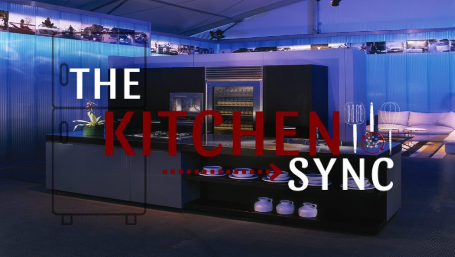

# The Kitchen Sync
<br>


## Description
MERN stack application - The Kitchen Sync is a user friendly web application that was built to sync your kitchen to your phone to help keep track of the ingredients you have in your kitchen, and provide recipes based off the ingredients that the user has readily available.

<br>

## Table of Contents
* [Application](#Application)
* [Installation](#Installation)
* [Usage](#Usage)
* [Contributing](#Contributing)
* [Tests](#Test)
* [Contributors](#Contributors)    
* [License](#License)


## Application
Please visit [The Kitchen Sync](https://thekitchensync.herokuapp.com/) which was deployed through Heroku.



## Installation
Run the following command to install all necessary dependencies:
```
npm install
```

## Usage
This is a react application with multiple node dependencies installed - please review the package.json file to ensure all necessary dependencies are installed.

## Contributing
No contributions are needed at this time.

## Tests
Run the following command to run tests:
```
N/A
```

## Contributors
[Justin Garner](https://github.com/jgarner828)
<br>

[Adam Kovacevich](https://github.com/Kovaceva11)
<br>

[Austin Wonka](https://github.com/AWonka)
<br>

[Jessica Haff](https://github.com/Jesshaff)

## License
This project is licensed under the MIT license.

https://opensource.org/licenses/MIT
